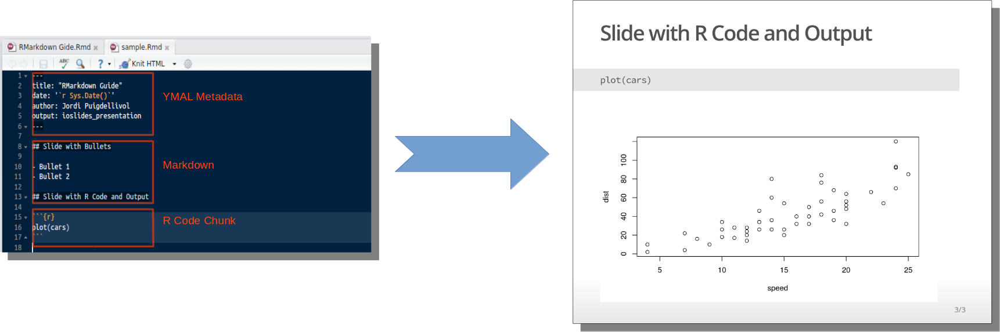
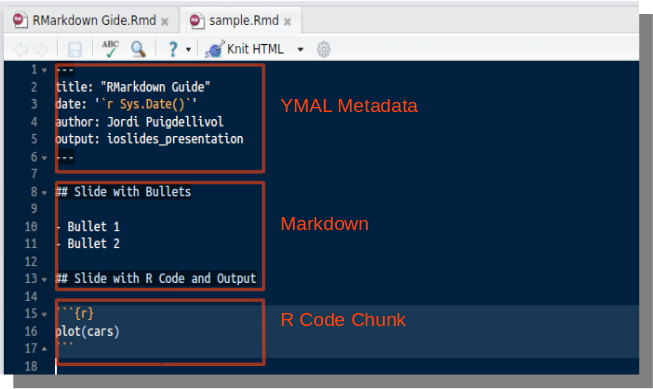
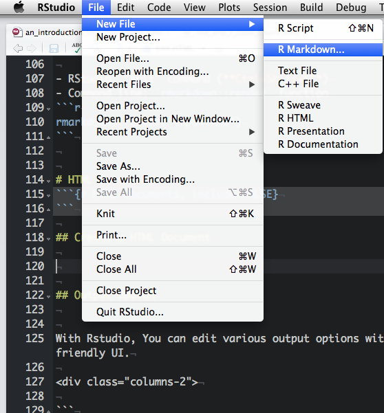
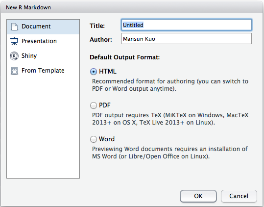
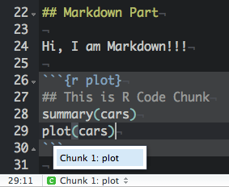

<!-- logo: assets/img/Taiwan-R-logo.png -->

# Preface
```{r Preface}
```

## What? {.build}

R Markdown is an authoring format that enables easy creation of dynamic documents, presentations, and reports from R. It combines the core syntax of markdown (an easy-to-write plain text format) with embedded R code chunks that are run so their output can be included in the final document. R Markdown documents are fully reproducible (they can be automatically regenerated whenever underlying R code or data changes).



## It happened everyday {.build}

<div class="columns-2">

1. Data preparation
2. Modeling
3. Generating report
4. Something wrong in your data
5. Repeat 1 ~ 4


</div>


## Why?

1.  Automate
    + Periodic documents
    + Adapted documents
    + Faster to implement
2.  Reproducible
    + Less errors
3.  Diferent formats
    + Html 
    + Pdf 
    + Presentations

## Research Pipeline {.smaller .centered}


[Roger D. Peng, Reproducible Research: Concepts and Ideas p.10 on Coursera](https://www.coursera.org/course/repdata)

# how to start?
```{r how_to_start}
```

## Installing R Markdown

- RStudio --- Install the [latest version of RStudio](http://www.rstudio.com/ide/download/preview)

- Other environments --- Install the [rmarkdown package](https://github.com/rstudio/rmarkdown).


## Overview

- YAML Metadata: [YAML](http://en.wikipedia.org/wiki/YAML) document options
- Markdown: Article text
- R Code Chunk: Executible R code




## Rendering Output

- RStudio: "Knit" command (**Ctrl+Shift+K**)
- Command line: `rmarkdown::render` function

```r
rmarkdown::render("input.Rmd")
```

## Create a HTML Document


<div class="columns-2">


</div>

# Markdown Basics
```{r Markdown Basics}
```

## Markdown Quick Reference


## Emphasis
```markdown
*italic*   **bold**

_italic_   __bold__
```

*I am italic*   

**I am bold**


## Headers

Setext:


```markdown
Header 1
=============

Header 2
-------------
```

atx:

```markdown
# Header 1

## Header 2

### Header 3
```    


## Lists


<div class="columns-2">
```html
Unordered List:

* Item 1
* Item 2
    + Item 2a
    - Item 2b

Ordered List:

1. Item 1
2. Item 2
3. Item 3
    + Item 3a
    + Item 3b


```


Unordered List:

* Item 1
* Iteivm 2
    + Item 2a
    - Item 2b

Ordered List:

1. Item 1
2. Item 2
3. Item 3
    + Item 3a
    + Item 3b

</div>


## Links & Images

A plain http address or add a link to a phrase.

**Link:**

```html
[rugbcn-r-users-group](http://www.meetup.com/es/rugbcn-barcelona-r-users-group/)
```
[rugbcn-r-users-group](http://www.meetup.com/es/rugbcn-barcelona-r-users-group/)


**Image**:

```html


```


## Plain Code Blocks

- Plain code blocks are displayed in a fixed-width font but not evaulated.

    <pre class="markdown"><code>&#96;&#96;&#96;
    This text is displayed verbatim / preformatted
    &#96;&#96;&#96;
    </code></pre>

- Specify the language of the block is avaliable

    <pre><code>```r
    x = rnorm(10)
    ```</code></pre>

    ```r
    x = rnorm(10)
    ```


## Embedding Equations

- LaTeX
    - Inline equation: `$equation$`   $\frac{1}{n} \sum_{i=i}^{n} x_i$ 

    - Display equation: `$$equation$$`
      $$\frac{1}{n} \sum_{i=i}^{n} x_i$$
      
    - Useful Resources
        - [Daum Equation Editor](https://chrome.google.com/webstore/detail/daum-equation-editor/dinfmiceliiomokeofbocegmacmagjhe?utm_source=chrome-ntp-icon): Chrome Plugin
        - [Online LaTeX Equation Editor](http://www.codecogs.com/latex/eqneditor.php)


## Tables

<div class="columns-2">
```html
First Header  | Second Header
------------- | -------------
Content Cell  | Content Cell
Content Cell  | Content Cell


```

First Header  | Second Header
------------- | -------------
Content Cell  | Content Cell
Content Cell  | Content Cell

</div>


## Text Color

You can color content using base color classes red, blue, green, yellow,
and gray (or variations of them e.g. red2, red3, blue2, blue3, etc.).

```html
<div class="red2">
This text is red
</div>
```

```{r results='asis', echo=FALSE}
library(whisker)
temp = '<span class="{{color}}{{number}}">{{color}}{{number}}</span>'
numbers = c("", "2", "3")
colors = c("red", "blue", "green", "yellow", "gray")
for (color in colors){
    cat("- ")
    for (number in numbers){
        out = whisker.render(temp)
        cat(out)
    }
    cat("\n")
}
```


# R Code Chunks
```{r R Code Chunks}
```


## Overview

R code will be evaluated and printed


<!--pre class="prettyprint lang-r"><code>&#96;&#96;&#96;{r}-->
<pre class="markdown"><code>&#96;&#96;&#96;{r}
summary(cars$dist)
&#96;&#96;&#96;
</code></pre>


```{r}
summary(cars$dist)
```


## Named R code chunk. 

<pre class="markdown"><code>&#96;&#96;&#96;{r plot}
summary(cars)
plot(cars)
&#96;&#96;&#96;
</code></pre>

- Easy Navigation in RStudio  




## Basic Chunk Options

- `echo`(TRUE): whether to include R source code in the output file
- `eval`(TRUE): whether to evaluate the code chunk
- `message`(TRUE): whether to preserve messages emitted by message()
- `include`(TRUE): if include=FALSE, nothing will be written into the output document, but the code is still evaluated and plot files are generated
- `warning`(TRUE): whether to preserve warnings in the output 

Set global chunk options:

```r
knitr::opts_chunk$set()
```

## Plots

- `dev`('png'): figure format(png, jpeg, tiff, svg, ...)
- `fig.path`('figure/'): figure path
- `fig.width`(7): figure width
- `fig.height`(7): figure height
- `dpi`(72): DPI (dots per inch)

<pre class="markdown"><code>&#96;&#96;&#96;{r dev='svg', fig.path='myplot',fig.width=5, fig.height=5}
plot(iris)
&#96;&#96;&#96;
</code></pre>

***

```{r dev='svg', fig.path='myplot',fig.width=5, fig.height=5,echo=FALSE}
plot(iris)
```


## Inline R Code

I counted 'r 1+1' red trucks on the highway.

<br>

```r
I counted `r 1+1` red trucks on the highway.
```

# Other Cool Stuff

```{r Other_Cool_Stuff}
```

## ggvis code

```{r message=FALSE, echo=TRUE, fig.height=2.5}
library(knitr)
library(ggvis)
mtcars %>%
    ggvis(x = ~wt, y = ~mpg) %>%
    layer_smooths(se=TRUE, opacity := 0.5, opacity.hover := 0.75) %>% 
    layer_points(fill = ~factor(cyl), size := 50, size.hover := 200) %>%
    set_options(hover_duration = 250)
```

## DataTable code

```{r message=FALSE, echo=TRUE, fig.height=2.5}
library(DT)
datatable(mtcars,options=list(pageLength=3))
```


## References
    
- [R Markdown Cheat Sheet](http://shiny.rstudio.com/articles/rm-cheatsheet.html)
- [R Markdown](http://rmarkdown.rstudio.com/)
- [knitr](http://yihui.name/knitr/)
- [RStudio Documentation](https://support.rstudio.com/hc/en-us/categories/200035113-Documentation)
- [Reproducible Research](https://www.coursera.org/course/repdata)
- [Shiny Articles](http://shiny.rstudio.com/articles/)
- [Slides GitHub Page](https://github.com/jpuigde/RMarkdown)
- [mansun_kuo](http://rpubs.com/mansun_kuo/24330)
- [Carlos Bort & Lluís Ramon](https://github.com/LluisRamon/rmarkdown-talk.git)
- [Examples](https://github.com/yihui/knitr-examples)


